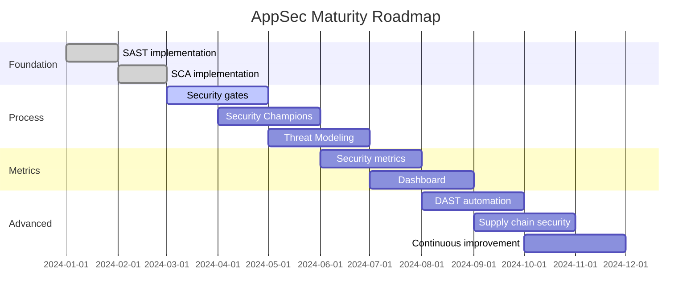

# AppSec Maturity Model

## Определение

AppSec Maturity Model — это подход к оценке и улучшению зрелости программы безопасности в организации.

## Три модели

У нас есть три основные модели, каждая со своим назначением:

| Модель | Назначение | Когда использовать |
|--------|-----------|-------------------|
| **BSIMM** | Benchmark — как у других? | Хочу сравнить с индустрией |
| **SAMM** | Roadmap — что делать дальше? | Хочу построить plan улучшений |
| **SSDF** | Compliance — что обязательно? | Нужен compliance (EO 14028) |

## Комбинированный подход

```
BSIMM ──▶ Где мы сейчас? (benchmark)
            │
            ▼
SAMM ──▶ Куда идти? (roadmap)
            │
            ▼
SSDF ──▶ Что обязательно? (compliance)
```

## Типичный AppSec Maturity Journey

### Level 1: Ad hoc
```
Характеристики:
  - Безопасность "по настроению"
  - Нет процессов
  - SAST? А что это?
  
Метрики:
  - Security team: 0-1 человек
  - Coverage: 0%
  - MTTR: N/A
```

### Level 2: Defined
```
Характеристики:
  - Базовые процессы определены
  - SAST в CI/CD (но не блокирует)
  - Есть security training
  
Метрики:
  - Security team: 1-2 человека
  - SAST coverage: 30-50%
  - MTTR: 30-60 дней
```

### Level 3: Managed
```
Характеристики:
  - Security gates блокируют CRITICAL
  - Threat Modeling для новых фич
  - Security Champions в командах
  
Метрики:
  - Security team: 3-5 человек
  - SAST coverage: 70-90%
  - MTTR: 14-30 дней
  - Vulnerabilities in prod: < 5%
```

### Level 4: Optimized
```
Характеристики:
  - Data-driven decisions
  - Автоматизация везде
  - Continuous improvement
  
Метрики:
  - Security team: 5+ человек
  - SAST coverage: 95%+
  - MTTR: < 14 дней
  - Vulnerabilities in prod: < 1%
```

## Как оценить текущий уровень

### Self-Assessment Questionnaire

```yaml
Governance:
  - Есть ли security policy? [Y/N]
  - Есть ли security roadmap? [Y/N]
  - Проводится ли security training? [Y/N]
  - Есть ли Security Champions? [Y/N]

Process:
  - Есть ли Secure SDLC? [Y/N]
  - Есть ли security gates? [Y/N]
  - Проводится ли Threat Modeling? [Y/N]
  - Есть ли security requirements в user stories? [Y/N]

Tools:
  - Используется ли SAST? [Y/N]
  - Используется ли DAST? [Y/N]
  - Используется ли SCA? [Y/N]
  - Используется ли Secret Scanning? [Y/N]

Metrics:
  - Собираются ли security метрики? [Y/N]
  - Есть ли dashboard? [Y/N]
  - Отчитываетесь ли перед менеджментом? [Y/N]
```

### Пример результата

```
Governance:   3/4 ✅
Process:     2/4 📝
Tools:       3/4 ✅
Metrics:     1/4 ❌

Overall: Level 2 — Defined
Next step: Добавить метрики и dashboard
```

## Roadmap на 12 месяцев



## Типичные проблемы

| Проблема | Решение |
|----------|---------|
| Нет buy-in от менеджмента | Показать BSIMM benchmark vs competitors |
| Слишком быстро/медленно | Baseline → target → roadmap с milestones |
| Нет ресурсов | Начать с бесплатных инструментов, показать ROI |
| Culture resistance | Security Champions + training |
| Слишком много frameworks | SAMM как основной, BSIMM как benchmark |

## Ключевые тезисы

- AppSec Maturity — это journey, не destination
- Три модели: BSIMM (benchmark), SAMM (roadmap), SSDF (compliance)
- Level 1 → Level 2: tools и процессы
- Level 2 → Level 3: automation и gates
- Level 3 → Level 4: data-driven и continuous improvement
- Начинать с малого, показывать прогресс
- Метрики — ключ к buy-in от менеджмента
- Security Champions — ключ к масштабированию
